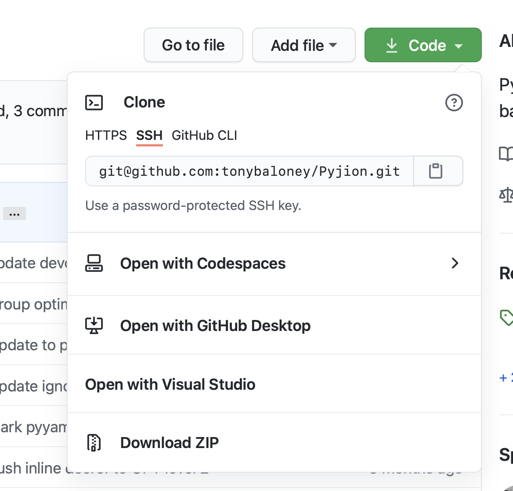

Development
===========

Building Pyjion from source is relatively involved process. Pyjion is a C++ project with a CMake build configuration. It requires libraries for Python and the .NET CLR.

Compiling from Source
---------------------

Prerequisites:

- CPython 3.9 or 3.10
- CMake 3.2 +
- .NET 6

At the command-line you can compile the project by using `setup.py`:

.. code-block::

 > git clone git@github.com:tonybaloney/pyjion --recurse-submodules
 > cd pyjion
 > python -m pip install -U https://github.com/tonybaloney/scikit-build/archive/vs2019.zip
 > python setup.py develop --build-type Debug

Pyjion uses a fork of scikit-build. This is because scikit-build still doesn't have Visual Studio 2019 support.

Devcontainer
------------

Pyjion comes bundled with a devcontainer. Devcontainers are a specification used by VS Code and GitHub. They contain both instructions for building and a Dockerfile for Linux.

Devcontainers are the fastest way to get started on the Pyjion source code.

Github codespaces
~~~~~~~~~~~~~~~~~

GitHub codespaces can build and open the devcontainer if you select the option within github:

This requires access to the codespaces preview programme.

VS Code
~~~~~~~

When opening the directory, VS Code will detect the devcontainer and ask if you want to build and open the project in the dev container. This requires:

- Docker
- The Remote Containers extension

This dev container will build a Linux docker container with all of the prerequisites and compile the project ready for testing.

CMake Flags
-----------

Pyjion has CMake flags to add additional debug output in the compiled binary. You can set any flags on the `setup.py` command:

.. code-block:: 

   $ python setup.py develop --build-type Debug -DCOMPILER_DEBUG=ON

Full list of flags:

.. list-table::
   :widths: 30 70
   :header-rows: 1

   * - Flag
     - Description
   * - COMPILER_DEBUG
     - Emit debug messages in the compiler
   * - BUILD_TESTS
     - Build the unit tests (on by default in Debug builds)
   * - GENERATE_PROFILE
     - Enable Profile Generation (PGO)
   * - DUMP_JIT_TRACES
     - Dump .NET JIT traces on compilation
   * - REPORT_CLR_FAULTS
     - Report .NET CLR faults
   * - DUMP_SEQUENCE_POINTS
     - Dump IL and native sequence points after compiling
   * - DUMP_INSTRUCTION_GRAPHS
     - Dump graphviz instruction graphs during compilation

Testing
-------

Because Pyjion is a complex project, it has a complex testing suite.

The tests are split into 4 stages:

1. The C++ unit tests to verify isolated scenarios
2. The Python tests to do integration testing and verify certain optimizations
3. Performance benchmarks to measure performance improvements
4. A test runner for the CPython regression suite

Catch2 Unit tests
~~~~~~~~~~~~~~~~~

The C++ unit test suite is around 1000 Python micro-functions to compile and test basic Python functionality.

You can run the unit tests binary from the build directory:

.. code-block::

    > ./unit_tests

    ...
    ===============================================================================
    test cases:  117 |  113 passed |  4 failed as expected
    assertions: 6465 | 6367 passed | 98 failed as expected

Benchmarks
~~~~~~~~~~

There are some preconfigured benchmarks in ``Tests/benchmarks``:

.. code-block::

    $ python Tests/benchmarks/bench_microbenchmarks.py

    <function test_floats at 0x10621ff70> took 1.7167979199999999 min, 2.2481216809999998 max, 1.9089201766 mean without Pyjion
    <function test_floats at 0x10621ff70> took 0.9969279479999997 min, 1.2294269269999987 max, 1.1075061115999998 mean with Pyjion
    Pyjion is 41.98% faster
    <function test_ints at 0x106892790> took 1.8965339189999995 min, 2.2599547509999987 max, 2.0514137473999994 mean without Pyjion
    <function test_ints at 0x106892790> took 1.4789822159999986 min, 1.742200779000001 max, 1.6008296068000007 mean with Pyjion
    Pyjion is 21.96% faster

This is not a comprehensive benchmark suite. There is the pyperformance benchmark suite available if you want to test, but keep in mind that some tests are still not compatible with Pyjion. See :ref:`Limitations` for more info.

Python test suite
~~~~~~~~~~~~~~~~~

The Python test suite is a Pytest project. It has custom Pytest hooks for:

- Running each test 3 times
- Preconfiguring Pyjion settings like the optimization level and profiling

.. code-block:: console

    $ pip install -r Tests/requirements_test.txt
    $ python -m pytest Tests/ -v --opt-level 1

CPython Regression Test Suite
~~~~~~~~~~~~~~~~~~~~~~~~~~~~~

There are two custom test-runners for the CPython regression test suite.

1. Smoke tests, a subset of the CPython regression tests
2. The full test suite

The smoke-test runner has 2 additional flags. ``-o <level>`` to set the optimization level, and ``--pgc`` to enable PGC.

Here is an example of running the smoke tests:

.. code-block:: console

    $ python Tests/run_smoke_tests.py -f Tests/python_smoke_tests.txt -o 0

The full test suite runner takes up to an hour to complete.

Here is an example of running the full test suite:

.. code-block:: console

    $ python -X dev -q Tests/run_libregr_tests.py -f Tests/python_tests.txt -v

The test input file depends on the OS:

- ``Tests/python_tests.txt`` for Linux
- ``Tests/python_tests_macos11.txt`` for macOS
- ``Tests/python_tests_win.txt`` for Windows
